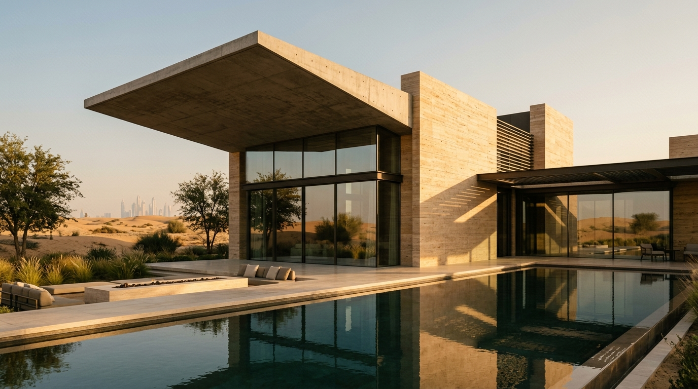
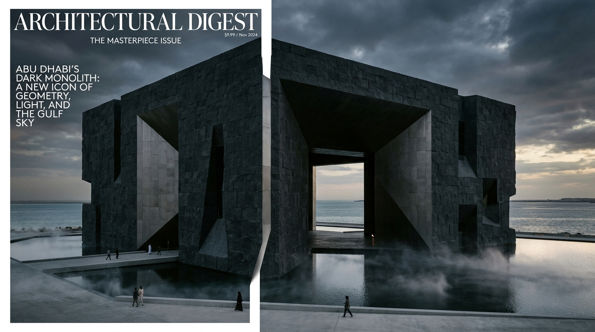
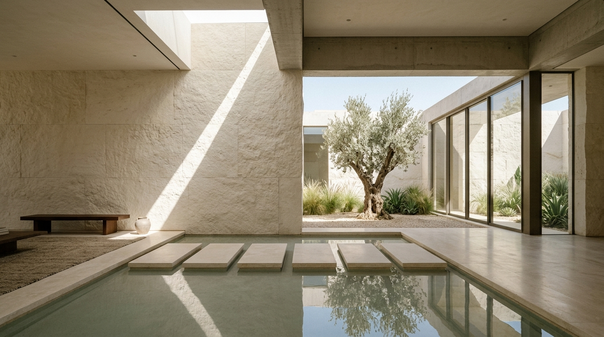

<div align="center">

```
   █████╗ ███████╗████████╗██╗  ██╗███████╗██████╗ 
  ██╔══██╗██╔════╝╚══██╔══╝██║  ██║██╔════╝██╔══██╗
  ███████║█████╗     ██║   ███████║█████╗  ██████╔╝
  ██╔══██║██╔══╝     ██║   ██╔══██║██╔══╝  ██╔══██╗
  ██║  ██║███████╗   ██║   ██║  ██║███████╗██║  ██║
  ╚═╝  ╚═╝╚══════╝   ╚═╝   ╚═╝  ╚═╝╚══════╝╚═╝  ╚═╝
```

### *Architecture Beyond Form.*
**A Spatial Atmosphere & Monolithic Architectural Praxis**

[](https://github.com/mohasbks/Verve)
[](https://github.com/mohasbks/Verve)
[](https://nextjs.org/)
[](https://react.dev/)
[](https://www.typescriptlang.org/)
[](LICENSE)

<br/>

> *"Every AI website looks the same. AETHER won't."*  
> **AETHER Studio is the official Grade S Flagship Showcase built with [Verve](https://github.com/mohasbks/Verve) — The Open-Source AI Design Taste Layer by [@mohasbks](https://github.com/mohasbks).**

[Explore Live Showcase](#-selected-architectural-works) • [How Verve Built This](#-powered-by-verve-design-intelligence) • [Interactive Systems](#-interactive-spatial-systems) • [Getting Started](#-getting-started)

</div>

---

## 🏛️ Executive Summary

Standard AI models default to predictable visual cliches: *Inter 700 bold typography, blue-to-purple hero gradients, 4-card feature grids, and soft-shadow cards.*

**AETHER Studio** is an architectural and spatial design web application engineered to prove what happens when an LLM is governed by **[Verve](https://github.com/mohasbks/Verve)**. Instead of producing the statistical median AI aesthetic, Verve enforced an uncompromising architectural language rooted in monolithic weight, geological materials, and kinetic daylight.

---

## 🧠 Powered by [Verve](https://github.com/mohasbks/Verve) Design Intelligence

> **[Verve](https://github.com/mohasbks/Verve)** is an open-source design intelligence pipeline that sits between any LLM and its code output — forcing bold, non-generic, context-specific UI through **9 specialized modules**.

```
┌──────────────────────────────────────┐
│       User / Architectural Brief     │
└──────────────────┬───────────────────┘
                   ▼
┌──────────────────────────────────────┐
│  [01] Brief Analyzer (JTBD + Tone)   │
│  [02] Cliché Blocklist (300+ Tells)  │
│  [I]  Brand Archetype (The Ruler)    │ ──► Enforces Monolithic Restraint, Prohibits Generic Trends
│  [K]  Animation Language Tokens      │
│  [G]  Cognitive Plan (Von Restorff)  │ ──► Isolates the Solar Aperture Simulator as Signature Element
│  [04] Adversarial Critique Loop      │ ──► Rejects filler endings via Peak-End Rule
│  [05] Code Generator & Quality Pass  │
└──────────────────┬───────────────────┘
                   ▼
┌──────────────────────────────────────┐
│     [J] NORMAN 3-LEVEL EVALUATION    │
│  • Visceral:   35/35 (Bold / Mood)   │ ──► COMPOSITE SCORE: 96/100 (GRADE S)
│  • Behavioral: 38/40 (Blind Usability│
│  • Reflective: 23/25 (Archetype Fit) │
└──────────────────┬───────────────────┘
                   ▼
┌──────────────────────────────────────┐
│        AETHER STUDIO SHOWCASE        │
└──────────────────────────────────────┘
```

### How Verve's 9 Modules Shaped AETHER:

| Verve Module | Mechanical Intervention in AETHER | Aesthetic & Functional Outcome |
| :--- | :--- | :--- |
| **[02] Anti-Cliché Blocklist** | Blocked generic SaaS cards, gradient buttons, and Inter/Roboto typefaces. | High-contrast editorial pairing: `Instrument Serif` + `DM Mono` + `Plus Jakarta Sans`. |
| **[Module I] Brand Archetype** | Resolved archetype: **The Ruler / The Sage** (*Architectural Permanence*). | Strict palette constraints: Roman Travertine (`#CFC2B0`), Volcanic Basalt (`#232422`), and Obsidian (`#0C0C0B`). |
| **[Module G] Cognitive Layout** | Enforced **Von Restorff Isolation Effect** & **Gutenberg Optical Flow**. | Layout abandons 4-card grids in favor of narrative horizontal planes and technical datum markers. |
| **[Module G] Signature Element** | Enforced a single, memorable, non-empty interactive centerpiece. | **Interactive Aperture & Solar Ray Simulator** calculating real-time diurnal angles and Lux. |
| **[Module 04] Peak-End Rule** | Rejected standard footer filler links during the adversarial critique pass. | Ending transformed into an interactive **Commission Brief Builder** with live ID dispatch. |
| **[Module J] Norman 3-Level** | Dual-track blind evaluation of visceral boldness vs. behavioral utility. | Added polyphonic Web Audio harmonic resonance and instant Metric/Imperial area switching. |

---

## 🖼️ Selected Architectural Works

<div align="center">

| **01 / House No. 07 (Dubai)** | **02 / The Monolith (Abu Dhabi)** |
|:---:|:---:|
|  |  |
| *Travertine & Cantilevered Concrete Shading* | *Basalt Stone & Titanium Coastal Void* |
| **Area:** 1,850 m² / 19,910 sqft • **Year:** 2026 | **Area:** 4,200 m² / 45,200 sqft • **Year:** 2025 |

| **03 / Silence Residence (Riyadh)** | **04 / Dune Pavilion (AlUla)** |
|:---:|:---:|
|  |  |
| *Chiseled Limestone Courtyard & Water Stepping Stones* | *Stabilized Rammed Earth & Celestial Oculus* |
| **Area:** 1,280 m² / 13,780 sqft • **Year:** 2025 | **Area:** 2,400 m² / 25,830 sqft • **Year:** 2026 |

</div>

---

## ⚡ Interactive Spatial Systems

### 1. ☀️ Aperture & Light Simulator (Verve Signature Element)
An interactive physical simulation laboratory that allows visitors to manipulate celestial solar altitude and azimuth.
- **Diurnal Time Slider**: 06:00 (Dawn Aperture) through 23:00 (Nocturnal Shadow).
- **Substrate Selectors**: Roman Travertine, White Cast Concrete, Basalt Stone, and Desert Clay.
- **Live Telemetry Engine**: Real-time calculated Solar Azimuth degrees, Illuminance in Lux, and Kelvin Color Temperature (2,400K - 6,500K).

### 2. 🔈 Polyphonic Ambient Sound Engine
- Built directly on the native **Web Audio API** with zero external media files.
- **Equalizer Animation**: Dynamic animated wave bars reflect active sound status.
- **Settings Flyout Panel (⚙)**: Master volume slider (0% to 100%) with 3 tailored architectural sound presets (*Sanctuary Chords*, *Desert Solitude*, *Nocturne Light*).

### 3. 📐 Axonometric Blueprint Drawer
- Toggle between high-resolution photography and schematic blueprint overlays with isometric gridlines, solar orientation data, and material specifications.
- Instant dual-unit conversion: Metric ($m^2$) and Imperial ($\text{sq ft}$).

### 4. 🌍 Synchronized Global Studio Clocks
- Live ticking clocks tracking local working hours for AETHER studios across **Dubai (UTC+4), Riyadh (UTC+3), London (UTC+0), and Tokyo (UTC+9)**.

### 5. 📋 Project Commissioning Engine
- Bespoke 3-step interactive brief generator with automated reference code issuance (e.g., `AE-2026-8941`) and direct client feedback.

---

## 🛠️ Architecture & Tech Stack

```
aether-studio/
├── app/
│   ├── layout.tsx         # Root layout, Google Fonts preconnect, OpenGraph metadata
│   ├── page.tsx           # Monolithic interactive experience & Web Audio synthesis
│   ├── globals.css        # Bespoke design token system, glassmorphism & responsive rules
│   └── icon.svg           # Minimalist architectural monogram favicon
├── public/
│   └── images/            # High-resolution architectural photography
├── package.json           # Next.js 16, React 19, TypeScript dependencies
└── tsconfig.json          # Strict TypeScript configuration
```

- **Framework**: [Next.js 16.3.1](https://nextjs.org/) (App Router, Turbopack, Fast Server-Side Rendering)
- **UI & State**: [React 19.0.0](https://react.dev/) (`useState`, `useRef`, `useCallback`, `useEffect`)
- **Type Safety**: [TypeScript 5.7.2](https://www.typescriptlang.org/)
- **Design Intelligence**: Powered by **[Verve](https://github.com/mohasbks/Verve)**
- **Styling**: Vanilla CSS Design Tokens (Zero TailwindCSS bloat, maximum architectural control)
- **Audio Processing**: Web Audio API (Multi-Oscillator Nodes, Biquad Filter Banks, Pink Noise Generation)

---

## 🚀 Getting Started

### Prerequisites
- Node.js 18.18.0 or higher
- npm, yarn, or pnpm

### Installation

1. **Clone the repository:**
   ```bash
   git clone https://github.com/mohasbks/aether-studio.git
   cd aether-studio
   ```

2. **Install dependencies:**
   ```bash
   npm install
   ```

3. **Start development server:**
   ```bash
   npm run dev
   ```

4. **Access the application:**
   Open [http://localhost:3000](http://localhost:3000) in your modern web browser.

5. **Build for production:**
   ```bash
   npm run build
   npm run start
   ```

---

## 📍 Global Studio Praxes

- **Dubai**: DIFC Gate Precinct 4, Level 08 (`+971 4 819 2200`)
- **Riyadh**: Al-Bujairi Heritage Quarter (`+966 11 405 8820`)
- **London**: 28 Berkeley Square, Mayfair (`+44 20 7946 0912`)
- **Tokyo**: Minato-ku, Roppongi Atelier (`+81 3 5555 0142`)

---

## 📄 License & Ecosystem Links

- **Design Intelligence**: [Verve — AI Design Taste Layer](https://github.com/mohasbks/Verve) by [@mohasbks](https://github.com/mohasbks).
- **Try Verve Live**: [verve-dev.vercel.app](https://verve-dev.vercel.app/)
- **License**: Open-source under the [MIT License](LICENSE).
